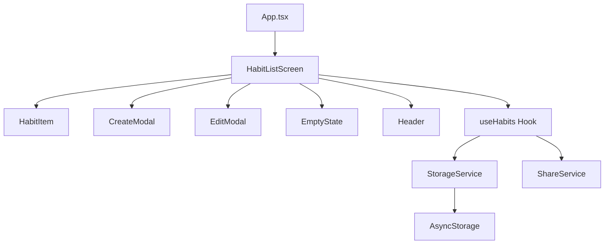

# 設計書: こつこつ - 習慣トラッキングアプリ

## Overview

「こつこつ」はReact Native + Expoで構築するiPhone向け単一画面の習慣トラッキングアプリである。ユーザーは最大10個の習慣項目を登録し、タップで累積カウントを記録する。データはAsyncStorageで永続化し、ルーティングは使用しない。

主要機能:
- 習慣リストの表示（最大10件）
- タップによるカウント記録
- 作成・編集・削除モーダル
- 共有機能（iOS Share Sheet）
- AsyncStorageによるデータ永続化

## Architecture

### 全体構成



### アーキテクチャ方針

- **単一画面構成**: ルーティングなし。`App.tsx`がルートコンポーネントとして`HabitListScreen`を描画
- **カスタムフック**: `useHabits`フックでデータ操作ロジックを集約し、UIとビジネスロジックを分離
- **サービス層**: `StorageService`（AsyncStorage操作）と`ShareService`（共有テキスト生成・共有シート呼び出し）を分離
- **モーダルパターン**: 作成・編集はモーダルオーバーレイで実装。React Nativeの`Modal`コンポーネントを使用

## Components and Interfaces

### App.tsx
アプリのエントリーポイント。`HabitListScreen`をレンダリングする。

### HabitListScreen
メイン画面コンポーネント。`useHabits`フックを使用し、習慣リスト・ヘッダー・モーダルを統合する。

```typescript
const HabitListScreen: React.FC = () => {
  // useHabitsフックからstate・操作関数を取得
  // モーダルの表示状態を管理
}
```

### HabitItem
個別の習慣項目を表示するコンポーネント。

```typescript
interface HabitItemProps {
  habit: Habit;
  onTap: (id: string) => void;
  onLongPress: (id: string) => void;
}
```

### CreateModal / EditModal
習慣項目の作成・編集用モーダル。

```typescript
interface CreateModalProps {
  visible: boolean;
  onSave: (name: string) => void;
  onClose: () => void;
}

interface EditModalProps {
  visible: boolean;
  habit: Habit | null;
  onSave: (id: string, name: string) => void;
  onDelete: (id: string) => void;
  onClose: () => void;
}
```

### useHabits Hook
習慣データの状態管理とCRUD操作を提供するカスタムフック。

```typescript
interface UseHabitsReturn {
  habits: Habit[];
  loading: boolean;
  error: string | null;
  addHabit: (name: string) => Promise<void>;
  updateHabit: (id: string, name: string) => Promise<void>;
  deleteHabit: (id: string) => Promise<void>;
  incrementCount: (id: string) => Promise<void>;
  canAddHabit: boolean;
}
```

### StorageService
AsyncStorageとのインターフェース。

```typescript
interface StorageService {
  loadHabits: () => Promise<Habit[]>;
  saveHabits: (habits: Habit[]) => Promise<void>;
}
```

### ShareService
共有テキストの生成と共有シートの呼び出し。

```typescript
interface ShareService {
  formatShareText: (habits: Habit[]) => string;
  share: (habits: Habit[]) => Promise<void>;
}
```

## Data Models

### Habit

```typescript
interface Habit {
  id: string;       // UUID v4で生成
  name: string;     // 習慣名（空白のみは不可）
  count: number;    // 累積カウント（0以上の整数）
}
```

### ストレージ形式

AsyncStorageに`@kotsu-kotsu/habits`キーでJSON配列として保存する。

```json
[
  { "id": "uuid-1", "name": "読書", "count": 15 },
  { "id": "uuid-2", "name": "運動", "count": 7 }
]
```

### バリデーションルール

- `name`: `trim()`後に空文字でないこと
- `count`: 0以上の整数
- 習慣リスト: 最大10件

## Correctness Properties

*プロパティとは、システムの全ての有効な実行において成り立つべき特性や振る舞いのことである。人間が読める仕様と機械的に検証可能な正しさの保証を橋渡しする形式的な記述である。*

### Property 1: ストレージラウンドトリップ

*For any* 有効な習慣項目の配列に対して、StorageServiceで保存した後に読み込むと、元の配列と等価なデータが返される

**Validates: Requirements 1.1, 6.1, 6.2**

### Property 2: 最大10件制限の不変条件

*For any* 習慣リストの状態と任意の操作列（追加・編集・削除・カウント更新）に対して、操作後の習慣リストの件数は常に10件以下である

**Validates: Requirements 1.3, 3.5**

### Property 3: カウント増加の正確性

*For any* 習慣項目に対して、incrementCountを実行すると、その項目のcountは正確に1増加し、他の項目のcountは変化しない

**Validates: Requirements 2.1, 2.2**

### Property 4: 習慣追加でリスト成長

*For any* 10件未満の習慣リストと有効な（空白でない）習慣名に対して、addHabitを実行すると、リストの件数が1増加し、追加された項目のcountは0である

**Validates: Requirements 3.3**

### Property 5: 空白名バリデーション

*For any* 空白文字のみで構成された文字列に対して、addHabitまたはupdateHabitを実行すると、操作は拒否され、習慣リストは変更されない

**Validates: Requirements 3.4, 4.4**

### Property 6: 編集時カウント維持

*For any* 習慣項目と有効な新しい名前に対して、updateHabitを実行すると、名前は更新されるがcountは変更前と同一である

**Validates: Requirements 4.3**

### Property 7: 削除後の除外

*For any* 習慣リストと削除対象の習慣項目に対して、deleteHabitを実行すると、その項目はリストに含まれず、リストの件数は1減少する

**Validates: Requirements 4.6**

### Property 8: 共有テキストに全項目含有

*For any* 習慣項目の配列に対して、formatShareTextの結果には全ての習慣項目の名前と累積カウントが含まれる

**Validates: Requirements 5.2**

### Property 9: 操作後の永続化一貫性

*For any* 習慣リストに対する操作（作成・編集・削除・カウント更新）の後、AsyncStorageに保存されたデータはメモリ上の習慣リストと一致する

**Validates: Requirements 2.3, 6.3**

## Error Handling

### ストレージ読み込みエラー
- AsyncStorageからの読み込み失敗時、空の習慣リスト（`[]`）で初期化
- ユーザーにエラーメッセージをトースト等で表示
- アプリは正常に動作を継続（新規作成等は可能）

### ストレージ保存エラー
- AsyncStorageへの保存失敗時、メモリ上の状態は維持（ロールバックしない）
- ユーザーにエラーメッセージを表示し、データが保存されていない可能性を通知

### バリデーションエラー
- 空白のみの習慣名: モーダル内にインラインエラーメッセージを表示
- 10件上限到達: 追加ボタンを無効化（エラーではなくUI制御で防止）

### 共有エラー
- 共有シートの表示失敗時、エラーメッセージを表示
- 0件時は共有ボタンを無効化して防止

## Testing Strategy

### テストフレームワーク

- **ユニットテスト**: Jest + React Native Testing Library
- **プロパティベーステスト**: fast-check

### ユニットテスト

具体的な例・エッジケース・エラー条件に焦点:

- 空状態メッセージの表示（要件1.4）
- 追加ボタンの配置と表示（要件3.1）
- 追加ボタンタップでモーダル表示（要件3.2）
- 10件時の追加ボタン無効化（要件3.5）
- 長押しで編集モーダル表示（要件4.1）
- 編集モーダルの名前プリセット（要件4.2）
- 削除ボタンで確認ダイアログ表示（要件4.5）
- 削除キャンセルでデータ維持（要件4.7）
- 共有ボタンの配置（要件5.1）
- 共有シートの呼び出し（要件5.3）
- 0件時の共有ボタン無効化（要件5.4）
- ストレージ読み込み失敗時の空リスト起動（要件6.4）
- ストレージ保存失敗時のエラー表示（要件6.5）

### プロパティベーステスト

各プロパティテストは最低100回のイテレーションで実行する。各テストは設計書のプロパティを参照するコメントを含める。

タグ形式: **Feature: kotsu-kotsu-overview, Property {番号}: {プロパティ名}**

- Property 1: ストレージラウンドトリップ - `StorageService`の保存→読み込みの等価性
- Property 2: 最大10件制限の不変条件 - 任意の操作列後の件数チェック
- Property 3: カウント増加の正確性 - `incrementCount`後のカウント値検証
- Property 4: 習慣追加でリスト成長 - `addHabit`後のリスト件数とカウント0検証
- Property 5: 空白名バリデーション - 空白文字列での`addHabit`/`updateHabit`拒否
- Property 6: 編集時カウント維持 - `updateHabit`後のカウント不変検証
- Property 7: 削除後の除外 - `deleteHabit`後のリスト除外検証
- Property 8: 共有テキストに全項目含有 - `formatShareText`の出力検証
- Property 9: 操作後の永続化一貫性 - 操作後のメモリ・ストレージ一致検証

各プロパティは単一のプロパティベーステストで実装する。ユニットテストとプロパティテストは相補的であり、両方が必要である。
